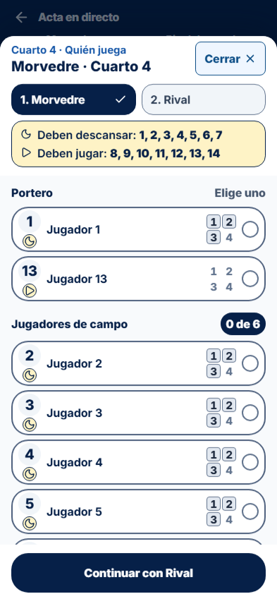
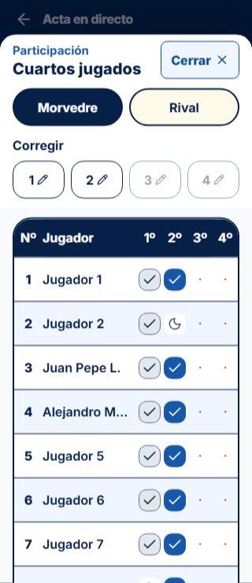
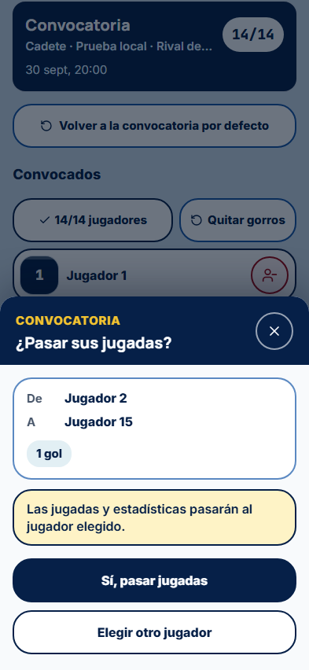

# Auditoría de cierre del acta

Fecha: 30 de septiembre de 2026. Estado: correcciones completadas y verificadas en el alcance descrito.

## Alcance

Acta en directo y sus pantallas relacionadas: entrada, preparación de gorros, convocatoria, participación juvenil, acciones, corrección, portería, finalización, tanda, PDF y persistencia/sincronización. Se conserva el flujo de juego que ya conocen los delegados. Las pruebas de navegador usan partidos ficticios e IndexedDB aislado; no se anotan acciones en los partidos reales del usuario. No se publica la aplicación ni la demo.

## Diseño y accesibilidad

- Dos familias de paneles: blanco para elegir/anotar/consultar durante el juego; cabecera azul oscuro para confirmar decisiones, guardar, salir, intercambiar gorros y trasladar jugadas. Se comparten componentes, animación, cancelación y recuperación del foco.
- Controles activos de al menos 48 × 48 px; acciones principales de 56 px. Texto principal de 16 px, títulos de 20 px e información compacta de al menos 14 px. Los símbolos pequeños de expulsión son complementarios a la descripción accesible.
- Selección de ambos equipos con acciones y errores fijos, más espacio útil para jugadores y regreso al principio al cambiar de equipo. Rival usa amarillo con texto oscuro; Morvedre usa azul.
- Nombres en una línea con abreviación adaptativa y nombre completo accesible. Tablas ordenadas por gorro y filas uniformes de 96 px, incluidas las de portero. El texto ampliado tiene una disposición alternativa para poder leer y desplazar el contenido.
- Marcas del cuarto pasado en gris y del cuarto actual activo en azul. La participación no aumenta algunas filas respecto a otras y sus marcas desaparecen desde el quinto cuarto.
- Avisos antes del cuarto 4 separados por equipo y motivo, con gorros concretos. Confirmación de incumplimientos agrupada en tarjetas con contornos, contraste y acciones visibles; no bloquea registrar lo que realmente ocurre.
- Jugadores añadidos o sustituidos desde una lámina inferior con búsqueda, lista y botón destacado para ampliar candidatos. Los mensajes de traslado se confirman antes de aplicar el cambio.
- Error de preparación junto al botón inferior; avisos de guardado distintos según conexión. La salida respeta el origen y permite guardar y volver cuando la convocatoria es válida.

## Hallazgos corregidos

| Hallazgo                                                                 | Corrección y evidencia                                                                                     |
| ------------------------------------------------------------------------ | ---------------------------------------------------------------------------------------------------------- |
| Segunda expulsión de Benjamín sin color; selectores con escala de tres   | Escala de sanciones compartida de tres/cuatro expulsiones; regresión de las cuatro etapas                  |
| Expulsiones mostradas como código o con cifras incoherentes en selección | Interpolación numérica y escala compartida entre tabla y selectores                                        |
| Marcas del cuarto demasiado pequeñas o confundibles                      | Indicadores ampliados y estados pasado/activo diferenciados                                                |
| Avisos de rotación repetidos, poco separados y acciones fuera de vista   | Agrupación por motivo, equipo alternable, contornos y pie fijo                                             |
| Scroll de Morvedre arrastrado a Rival, ocultando al portero              | Reinicio del área desplazable al cambiar de equipo                                                         |
| Corrección limitada visualmente al cuarto actual                         | Selector de todos los cuartos o uno concreto, con contexto de la jugada original                           |
| Corrección de portero anterior alteraba al portero actual                | Corrección por tramo histórico, conservando los demás tramos y el cuarto actual                            |
| Cambios repetidos de portero antes de una jugada podían ser ambiguos     | Identificación del tramo por su índice y regresión con tres cambios antes de anotar                        |
| Tanda bloqueada después de su primer lanzamiento                         | Liberación del bloqueo de registro también tras un guardado correcto; varios turnos y deshacer comprobados |
| Convocados sin gorro se descartaban al preparar el acta                  | Se conservan y se dirige a asignación de gorros; no se oculta un jugador de la convocatoria                |
| Petición de carga o guardado que no respondía podía bloquear el flujo    | Plazo de ocho segundos, recuperación preparada y reintento sin borrar cambios                              |
| Salir mientras se leía convocatoria podía retener su bloqueo de pestaña  | Cancelación de lecturas diferidas y un único ciclo de bloqueo/persistencia compartido con el acta          |
| Respuesta tardía del acta podía sobrescribir una convocatoria posterior  | Se ignoran confirmaciones tras liberar el editor y se conserva la mutación pendiente                       |
| Cambios offline pendientes dependían de volver al acta                   | Sincronización compartida en convocatoria y en la app, con bloqueo exclusivo por partido                   |
| Foco perdido al cerrar una lámina sin Dialog.Trigger                     | Recuperación del control que abrió el panel; verificación con teclado y Escape                             |
| Scroll interior no accesible por teclado                                 | Regiones desplazables identificadas y enfocables; hallazgo real de axe corregido                           |
| Rojo de error de convocatoria con contraste insuficiente                 | Texto y controles de error en rojo oscuro; nueva comprobación de contraste                                 |
| Etiquetas cortadas con texto ampliado                                    | Reorganización de controles y contenido para mantener acceso y lectura                                     |
| Formularios de partido omitidos por React Compiler debido a watch        | Suscripciones useWatch compatibles, sin advertencias de lint                                               |

## Funcionamiento sin conexión y protección de datos

1. Se prepara el partido con conexión una vez. Convocatoria, candidatos, reglas, jugadas, preguntas pendientes y selección incompleta se conservan en este móvil.
2. Cada acción confirmada se escribe en IndexedDB antes de anunciarla como guardada. Un fallo de almacenamiento no suma la acción ni muestra éxito.
3. La edición temporal permite dejar un jugador sin gorro y cambiarlo por un gorro ocupado; el otro jugador pasa a sin gorro y sigue en la lista. Ninguna convocatoria se guarda con gorros ausentes, duplicados o sin portero.
4. Las estadísticas siguen el ID del jugador. Un reemplazo confirmado traslada sus acciones, participación y portería; no duplica el marcador. No se elimina a alguien con historial sin elegir sustituto.
5. Cada envío mantiene una mutación identificable y una copia en vuelo. Si se pierde la respuesta, se reintenta la misma operación; las acciones nuevas y correcciones posteriores se conservan.
6. Se comparte el reconocimiento de respuestas entre el editor activo y la sincronización de la app. Una respuesta recibida después de salir no sobrescribe la edición nueva.
7. Los Web Locks impiden que dos pestañas escriban el mismo acta. Al cerrar la primera, la segunda lee la versión local más reciente. La sincronización en otras pantallas solo trata datos del usuario y dispositivo actuales y respeta esos bloqueos.
8. El cambio a otro móvil exige conexión y relevo confirmado. El móvil anterior conserva cambios locales pendientes y no puede sobrescribir al nuevo propietario. Una respuesta incierta del relevo conserva su identificador para recuperarlo.
9. El service worker guarda el shell público de acta/convocatoria y recursos necesarios; no añade caché de respuestas autenticadas. El documento deportivo está separado en IndexedDB.

## Reglas y casuísticas verificadas

- Infantil: seis jugadores de campo; Alevín/Benjamín/Escuela: cinco. Control hasta el cuarto 4. Cadete, Juvenil y Absoluto conservan el flujo habitual.
- Avisos de quienes deben jugar o descansar, portero único confirmado cuando corresponde, referencias válidas, sustituciones definitivas y ausencia de datos distinta de descanso.
- Asistentes y lanzadores restringidos a la alineación durante los cuartos controlados, en ambos equipos. Acción directa de un jugador no seleccionado pide revisar la alineación.
- Cuartos 5/6 sin marcas ni filtro juvenil de selección; se mantiene el historial y la excepción reglamentaria infantil de descanso tras sustitución definitiva.
- Corrección de una jugada de otro cuarto, anulación de un gol con su asistencia, relación de penalti/lanzamiento, identidad después de intercambio y reemplazo con estadísticas.
- Tanda con varios lanzamientos, deshacer, recuperación offline, ganador, cierre y descarga del PDF.

## Salud del código y limpieza

La lógica sigue en funciones de dominio puras. Se extrae un único protocolo de sincronización y una única escala de sanciones, y la convocatoria reutiliza el hook del acta. Se eliminan su ciclo de bloqueo/persistencia duplicado y estilos de sanción obsoletos. No se añaden dependencias ni migraciones para estas correcciones. Se conservan los componentes de acciones ya conocidos.

Se retiran tres scripts de exploración visual ya reemplazados por las pruebas reproducibles. Capturas, informes y logs de auditoría se conservan como evidencia en el directorio local ignorado; una selección de capturas se incluye junto al informe.

## Verificación

| Comprobación                     | Resultado                                                                                                                                         |
| -------------------------------- | ------------------------------------------------------------------------------------------------------------------------------------------------- |
| Suite unitaria completa          | 743 pruebas aprobadas, 81 archivos                                                                                                                |
| Recorridos de navegador aislado  | 10 aprobados: juego, dos pestañas, convocatoria, tanda/PDF, participación, quinto cuarto, móvil corto, texto ampliado y recuperación real offline |
| Revisión automática axe          | 34 vistas sin infracciones automáticas de los criterios WCAG 2/2.1/2.2 A/AA cubiertos por axe                                                     |
| Medidas de controles             | Sin objetivos activos inferiores a 48 px ni desbordamiento horizontal en las vistas comprobadas                                                   |
| Móviles simulados                | 320 × 568, 320 × 740 y 393 × 852; texto ampliado al 200 %, teclado, foco y movimiento reducido                                                    |
| TypeScript y build de producción | Correctos                                                                                                                                         |
| ESLint del ámbito auditado       | Sin errores ni advertencias de código                                                                                                             |
| Contratos SQL reales del acta    | Tres scripts aprobados con transacciones revertidas                                                                                               |
| Permisos de base de datos        | RLS habilitado y RPC de persistencia/preparación accesibles solo mediante service role                                                            |

Las pruebas SQL son `tests/database/live-match-sheets.sql`, `tests/database/youth-participation.sql` y `tests/database/youth-participation-save.sql`. Comprueban permisos, referencias, categoría, cuatro expulsiones, versiones, idempotencia, participación y relevo. La migración juvenil `20260930002921` ya está aplicada; estas correcciones no necesitan otra. Las transacciones de prueba no dejan partidos ni perfiles temporales.

Comandos reproducibles:

```powershell
npx vitest run tests/unit --maxWorkers=4
npm run build
$env:ACTA_AXE_PATH = 'ruta-local/axe.min.js'
npx playwright test --config playwright.acta.config.ts
```

`ACTA_AXE_PATH` es opcional y permite usar axe local sin añadirlo como dependencia del producto. Los recorridos y las medidas de controles se ejecutan también sin ese archivo. Los resultados locales están en `tmp/acta-audit/`: `unit-final.log`, `browser-verified.log`, `build-final.log`, `accessibility-summary.json`, capturas y detalles por vista.

## Capturas de referencia







## Límites de la evidencia

La comprobación automática complementa la revisión visual; no acredita por sí sola todos los criterios WCAG ni una certificación. No se ha simulado la expulsión del almacenamiento por el sistema operativo ni se ha probado físicamente en cada iPhone/Android del club. Sin preparar el partido con conexión una vez, el móvil no puede inventar la convocatoria. El envío necesita la app abierta y conexión; no se promete sincronización con la aplicación cerrada.

La suite general que incluye integraciones ajenas al acta encontró un bloqueo de red del entorno en `challenger` al intentar crear un usuario de prueba. No es un fallo del acta ni se presenta esa suite como aprobada. La suite unitaria completa y los contratos reales específicos del acta descritos arriba sí están verificados. JSDOM emite avisos de navegación no implementada y de act en algunos tests; los recorridos reales comprueban la navegación y no detectan errores de página.

El servidor local y el navegador integrado se actualizan con la compilación verificada. Se conserva el partido abierto y su selección; no se inicia el cuarto ni se guardan jugadas nuevas en él durante la revisión.
