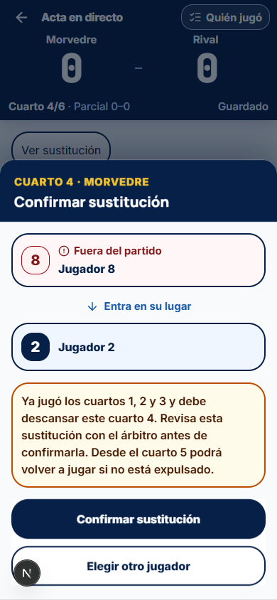
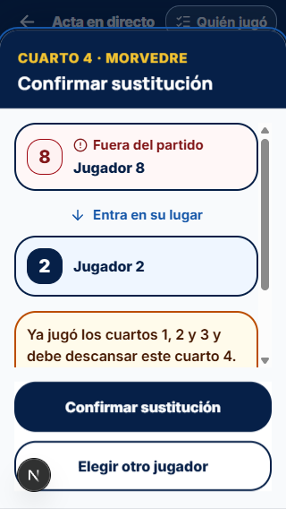

# Traslado de correcciones de la demo a Morvedre Core

Fecha: 1 de octubre de 2026.

## Alcance y respaldo

Se trasladan las correcciones aprobadas de la beta y las últimas mejoras de sustituciones, navegación entre equipos y PDF. La demo se ha utilizado únicamente como referencia de lectura; no se han editado sus archivos ni desplegado otra versión.

Punto de retorno previo de Core: **`8972f408d77427d16a7295eff1d2f7e59cdab48c`**, referencia **`codex/core-before-demo-sync-2026-10-01`**. Incluye los cambios pendientes y los dos archivos no ignorados que estaban sin seguimiento. Se creó con un índice alternativo; la rama activa y el índice original se conservaron.

La función SQL anterior se conserva en `backups/core-demo-parity-2026-10-01/before-rpc.sql` (respaldo local ignorado por Git). Solo se ha cambiado código de validación de funciones en Supabase; las verificaciones no han escrito partidos, usuarios ni estadísticas reales.

Referencia: demo local publicada `morvedre-acta-demo-8341700e2708`, informes `docs/beta-qa-2026-10-01.md`, `docs/beta-fixes-2026-10-01.md` y decisiones de la demo.

## Lista de traslado

| Punto                       | Resultado en Core                                                                                                                                                                                                                                                                                   |
| --------------------------- | --------------------------------------------------------------------------------------------------------------------------------------------------------------------------------------------------------------------------------------------------------------------------------------------------- |
| F01 · Expulsados            | Roja o límite de expulsiones desactivan al jugador para los cuartos posteriores. Confirmar una excepción de descanso no permite saltarse una expulsión. La corrección de un cuarto anterior conserva su contexto; anular la sanción elimina el bloqueo.                                             |
| F02 · Previsión             | Avisos por equipo, separando campo y portería, con elegibles tras sanciones y descansos, plazas disponibles y cuarto afectado.                                                                                                                                                                      |
| F03 · Borradores            | Revisión local propia y comprobación de mutación/revisión dentro de una transacción IndexedDB. Una selección obsoleta se rechaza sin sobrescribir datos y carga la versión guardada para poder reabrirla. Las escrituras propias sucesivas funcionan. Se conservan los bloqueos de pestaña de Core. |
| F04 · Resultados            | Marcador, parciales y cierre del cuarto comparten el orden local–visitante.                                                                                                                                                                                                                         |
| F05 · Identidad del partido | El reemplazo/borrado de la única partida local pertenece a la demo. Core conserva sus rutas con matchId, permisos de usuario, dueño y dispositivo, revisión de servidor y sincronización idempotente. No se importa el almacén de la demo.                                                          |
| F07 · Nombres en PDF        | El encabezado individual del portero reserva el espacio de sus cuartos y ajusta el nombre en una línea: completo, abreviado y, si hace falta, puntos suspensivos.                                                                                                                                   |
| F08 · Instalación           | La ayuda iOS usa la lámina compartida, contiene el foco, admite Escape y devuelve el foco. Se mantiene el flujo de instalación real de Core.                                                                                                                                                        |
| F10 · Selección accesible   | Los pasos de alineación son botones de 48 px con aria-pressed. Los formularios reales de Core conservan sus selectores semánticos; no se importa la pantalla de creación local de la demo.                                                                                                          |
| R01 · Datos locales         | Validación de fecha, revisión, orientación, referencias y peticiones pendientes antes de usarlas o enviarlas. Los documentos corruptos no se borran ni se envían; se conserva el aviso existente, sin nuevos carteles de recuperación.                                                              |
| Encabezado de salida        | Las decisiones compartidas recuperan su cabecera azul oscuro.                                                                                                                                                                                                                                       |
| Sustituciones               | Selector y confirmación con cabecera azul, ficha de salida con rojo muy sutil, filas completas y nombres adaptativos. Altura natural, límite por pantalla y acciones visibles.                                                                                                                      |
| Elección obligatoria        | No se puede cerrar, usar Escape, pulsar fuera ni posponer mientras haya candidatos. Desde la confirmación sí se puede volver a elegir otro jugador.                                                                                                                                                 |
| Sin sustitutos              | No se abre un modal vacío ni queda un aviso de elección pendiente. El equipo juega con uno menos; el siguiente cuarto ajusta sus plazas a los jugadores disponibles.                                                                                                                                |
| Portero expulsado           | Se ofrece el otro portero elegible; si no queda ninguno, un jugador de campo puede asumir la portería, incluso alguien ya en el agua. Se mantienen identidad, tramos, estadísticas y acciones de portero.                                                                                           |
| Quinto cuarto               | Se elimina la regla y el aviso incorrectos de descansar todo el quinto. Desde el quinto desaparecen las restricciones de participación; las expulsiones se mantienen.                                                                                                                               |
| PDF                         | Eliminado el anexo de participación de Benjamín, Alevín e Infantil. Se conserva el partido cuarto a cuarto y la tanda de penaltis.                                                                                                                                                                  |
| Navegación de equipos       | Tocar Morvedre desde Rival vuelve a su selección. Tocar Rival valida primero la selección propia. Ambos borradores se conservan.                                                                                                                                                                    |

Por petición previa del usuario, se mantienen F06 (no ampliar alfabetos del PDF), F09/F11 (elementos visuales de la demo), R02 (no añadir más avisos de recuperación) y D01 (excepción de plantilla de la demo). Core mantiene **8 jugadores mínimos en ambos equipos de Benjamín/Alevín y 9 en Infantil**. La excepción de siete Benjamines propios de la demo no se ha trasladado.

## Adaptaciones específicas de Core

- Se conservan las Server Actions, autorización del delegado, propiedad/dispositivo, carga real de la convocatoria, rutas oficiales, IndexedDB, vuelos de sincronización y relevo. Los reintentos conservan las mismas mutaciones.
- Un cuarto con menos jugadores disponibles por expulsión guarda su motivo en el campo de incidencia ya existente. Esto evita que la validación SQL rechace la alineación reducida; no añade una confirmación ni un aviso nuevo al delegado.
- La migración **`20261001125450_acta_demo_parity_emergency_keeper.sql`** está aplicada. Añade una función pura que reconoce el portero de emergencia únicamente a partir de alineación, sustitución y sanción definitiva válidas. Rechaza una lesión, una sanción anulada, el cuarto incorrecto, un sustituto expulsado o una expulsión ajena a la portería.
- El cuerpo de `save_live_match_sheet` cambia exclusivamente su predicado de gorro de portero. Se comparó su definición anterior y posterior: permisos, propiedad, revisión, cierre y convocatoria permanecen intactos. Ambas funciones de guardado y la función auxiliar conservan **SECURITY INVOKER**, search_path vacío y ejecución solo para postgres/service_role.
- El asesor de seguridad no señala las funciones modificadas. Sus avisos sobre otras funciones, tablas y configuración Auth quedan fuera del traslado.

## Verificación

- Antes de trasladar: **6 regresiones reproducidas** mediante tests fallidos; registro local `tmp/acta-audit/core-demo-sync/parity-before.log`.
- Después: **815 pruebas unitarias correctas en 87 archivos**. Incluyen selector real conectado al hook de Core, persistencia offline, conflictos entre pestañas, reintentos, respuestas tardías, expulsiones, sustitutos, mínimos y PDF. Registro: `tmp/acta-audit/core-demo-sync/unit-suite.log`.
- **15 aserciones SQL correctas** dentro de la migración y repetidas después de aplicarla. Pruebas mantenidas en `supabase/tests/acta_emergency_keeper.sql`.
- TypeScript y lint de los archivos modificados correctos. **Compilación de producción correcta**, incluido el service worker. Registros en `tmp/acta-audit/core-demo-sync/`.
- Prueba visual con los componentes reales de Core y datos ficticios, sin escribir partidos reales: 390×844 y 320×568. Sin desbordamiento horizontal. En 390 px, la confirmación crece hasta 619 px y el contenido no necesita scroll; en 320 px, el contenido largo usa scroll y ambos botones de 56 px quedan visibles. Escape no cierra la sustitución obligatoria. El escenario temporal se retiró antes de compilar.
- PDF de Core generado e inspeccionado: 5 páginas, sin anexo de participación y con tanda. El encabezado de portería no solapa los cuartos. Archivo local: `tmp/acta-audit/core-demo-sync/core-pdf.pdf`.

La suite de integración remota general no se acredita: su preparación falló por restricción de red (EACCES) y se detuvo. No se han creado usuarios de prueba en producción ni cambiado permisos para ejecutarla. La validación SQL específica sí se ha ejecutado en el proyecto real con datos ficticios y sin mutaciones de negocio. Tampoco se acredita aquí una prueba en móvil físico o una actualización instalada de Core.

## Evidencia visual

[Verificación de la función y sus permisos](evidence/core-demo-parity-2026-10-01/database-verification.json)
