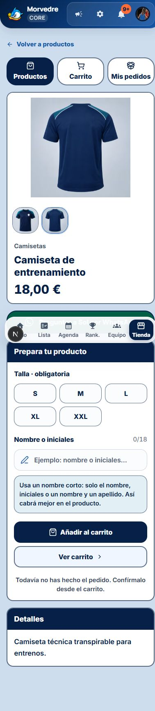

# Tienda pública · Detalle y carga

## Cambios solicitados

- Imagen ampliable mediante toque o teclado, sin rótulo superpuesto. Se mantienen miniaturas, cierre accesible y navegación entre fotos.
- Precio sin el texto Precio por unidad.
- Descripción en azul oscuro, 17 px y peso 600.
- Contacto compartido con Sol: WhatsApp verde oscuro, texto blanco, borde oscuro y altura mínima de 56 px. Disponible en catálogo, producto, carrito, listado y detalle de pedidos y aprobación familiar. El mensaje contextual se prepara al abrir WhatsApp; la aplicación no lo envía.
- Corrección de las capturas superpuestas durante la carga.

## Diagnóstico de carga

El componente PageShell aplica una transición de salida `fade reverse`. La regla CSS no conservaba el estado final de la animación. Al acabar sus 150 ms, la captura anterior recuperaba la opacidad 1 mientras la siguiente captura empezaba a mostrarse. El DOM no duplicaba las páginas; el solapamiento estaba en las capturas de las transiciones del navegador.

Se añade `both` a la animación de salida en `app/globals.css`. La captura mantiene la opacidad 0 durante el resto de la transición. Se conserva la animación existente y no se cambia la lógica de pedidos.

## Verificaciones

- Navegación real en el navegador local: muestreo cada 16 ms de las opacidades de las capturas antiguas y nuevas. Antes de corregir: 37 fotogramas con ambas visibles. Después: 0, en 52 fotogramas de transición, con opacidad final 0 de la captura saliente. Las pantallas de carga se completan y aparece el producto.
- Móvil 393 × 852 px: sin desbordamiento horizontal; botón WhatsApp de 56 px; descripción con color RGB(6, 32, 72), 17 px y peso 600.
- Activación de imagen con Enter, cambio de foto y cierre con Escape comprobados.
- Axe en el contenido del detalle de producto: 0 infracciones y 0 comprobaciones incompletas para WCAG A/AA y 2.2 AA. Esto no equivale a una certificación completa de accesibilidad.
- `npx vitest run tests/unit/shop-public-ui.test.tsx`: 14 pruebas pasan.
- `npx tsc --noEmit` y ESLint de tienda pública y componente de contacto: sin errores.

No se enviaron pedidos ni mensajes de WhatsApp. La demo no se modifica.

